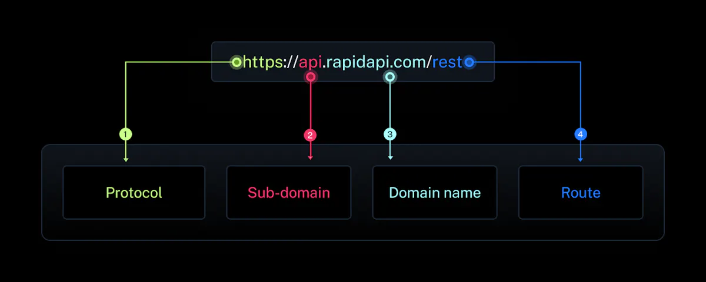
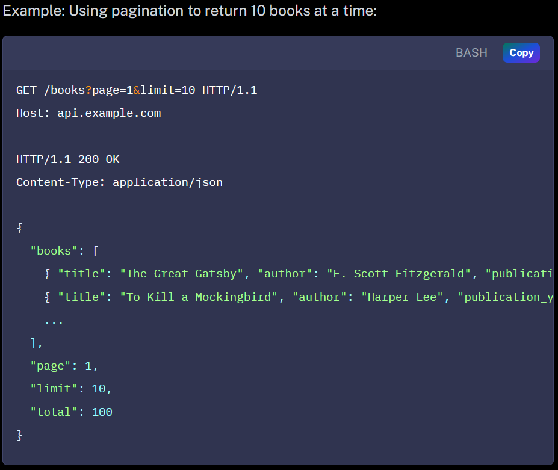

# **[#RAPID API LEARN]()**

## **1. What's a REST API ?**

Is a API that follows the design principles of the REST (or REpresentational State Transfer) architecture.

## **2. What's HTTP**

HTTP is an application layer protocol, wich means that it provides a standarized way for applications to communicate with each other over the internet. HTTP defines a set or request methods, response codes,headers, and message formats that are used to exchange data between clients and servers

### [- HTTP Methods]()

#### + GET : to ask something from the server

#### + POST : used to send data to the server

#### [+ PUT](put) : used to update a resource

#### + DELETE : asks the srver to delete a resource

#### + PATH : is similar to [PUT](#put) but , you will change only a part of a resource

### [- RESPONSE CODES]()

*Note : HTTP defines a set of response codes that indicate the status of a
request. These codes are three-digit numbers that are sent by the server
 in response to a client's request. Response include : Status line, Headers and the body*

#### + Some of status code interval and their meaning :

* 2xx: Success codes, like 200 OK, which means the request was successful and the server is sending back the requested data.
* 3xx:
  Redirection codes, like 301 Moved Permanently, which means the
  requested resource has moved to a new location and the client needs to
  update its URL.
* 4xx: Client error codes, like 404 Not Found, which means the requested resource couldn't be found on the server.
* 5xx:
  Server error codes, like 500 Internal Server Error, which means there
  was an error on the server that prevented it from fulfilling the request

### - [Headers](https://rapidapi.com/learn/rest#headers)

HTTP
 defines a set of headers that can be used to provide additional
information about a request or response. Headers are key-value pairs
that are included in the HTTP message.

Headers provide more context about the request or response and can be used for a variety of purposes, such as:

* Authorization headers can be used to include authentication credentials with a request to access protected resources.
* Cache-Control
  headers can be used to specify how long a client should cache a
  response to avoid unnecessary requests to the server.
* Content-Type headers can be used to indicate the type of data being sent in the request or response, such as JSON or XML.
* Accept headers can be used to specify which data type a client can accept in the response.

### - [Message formats](https://rapidapi.com/learn/rest#message-formats)

HTTP
 messages are the way that clients and servers communicate with each
other. There are two types of HTTP messages: requests and responses.

An HTTP request message is sent by a client, like a web browser, to a server, and it consists of three parts:

* Request
  line: This includes the HTTP method being used, the URL of the resource
  being requested, and the version of the HTTP protocol being used.
* Headers:
  These are additional pieces of information sent along with the request
  that provide more context about the request, as explained in my previous
  answer.
* Body: This is an optional part of the message that contains data being sent along with the request, such as form data or JSON.

An HTTP response message is sent by a server to a client in response to an HTTP request, and it also consists of three parts:

* Status
  line: This includes the HTTP version being used, a response code
  indicating whether the request was successful or not, and a short
  message explaining the response code.
* Headers: These are additional pieces of information sent along with the response, as explained in my previous answer.
* Body: This is an optional part of the message that contains the data being sent back to the client, such as HTML or JSON.

## 3. Types of HTTP headers

### - Request headers

From the client to the server

### - Response headers

From the server to the client

### - Entity headers

Sent with the body of the request or reposponse. Provide information about the content

## 4. Types of HTTP methods

#GET : sending the same request multiple time have same effect

#POST : sending the same request multiple time don't have same effect

#PUT : sending the same request multiple have the same effect while updating the resource

#DELETE : Same effect as sending it multiple time

### - [OPTIONS](https://rapidapi.com/learn/rest#options)

This
 method is used to retrieve information about the communication options
available for a resource. When a client sends an OPTIONS request, the
server responds with a list of the available methods, headers, and other
 communication options for the specified resource.

### - [HEAD](https://rapidapi.com/learn/rest#head)

This
 method is similar to the GET method, but it only retrieves the headers
for a resource and not the body. When a client sends a HEAD request, the
 server responds with the headers for the specified resource but does
not send the actual content.

### - [CONNECT](https://rapidapi.com/learn/rest#connect)

This method is used to establish a network connection to a resource. When a client sends a CONNECT request, the server responds with a tunnel that
can be used to establish a secure connection to the specified resource.

### - [TRACE](https://rapidapi.com/learn/rest#trace)

This method is used to retrieve a diagnostic trace of the communication
between a client and a server. When a client sends a TRACE request, the
server responds with a message that contains a copy of the request and
response headers.

## 5. WHAT'S REST API

REST (Representational State Transfer) APIs allow computers to talk to
each other over the internet in a way that is standardized and easy to
understand.

## 6. Key features of REST APIs

### - Client-Server architecture

### - Stateless communication

The requeest contain all the information needed for the server to understand it.

### - Uniform interface

#### + Use of same data format

#### + Use of Standarized HTTP

### - Use of hypermedia

Means that the response form the server includes links related to each resource. In that way each resource has its own URL.

## 7. Principles of REST API

REST APIs has six design principles :

### - Client-server Separation : they don't depend on other

### - Stateless : the server doesn't remeber anything from the previous request

### - Cacheable : Caching process, when the server store response to a request to respond quickly next time

### - Layered System : REST APIs can have multiple layers

### - Uniform interface

### - Coede on Demand(Optional)

Some RESTful APIs may provide executable code to the client.

## 8. Anatomy of a REST API

### - Resource : A resource is an object or concept that can be accessed via a URL.

Each Resource should have an unique identifier.

### - HTTP methods

### - URI(Uniform Resource Identifier) : An unique identifer for a resource

### - HTTP headers

Some common headers used in RESTful APIs include Content-Type (which indicates the format of the data being sent or received) and Authorization (which provides authentication information for the request).

### - Request body : data sent usinf typically JSON or XML format.

### - Response body : data returned from the server

### - Status codes

Status codes are used to indicate the status of a request or response. Status codes are three-digit numbers that are returned by the server in response to a request.

## 9. CRUD Operations

### - Create

### - Read

### - Update

### - Delete

## 10. Best Pratices for REST API

### - Use meaningful resource URIs : easy to understand and identify

### - Use HTTP methods correctly

### - Use HTTP response codes correctly

### - Use nouns instead of verbs  in URIs

### - Use consistent naming conventions : HTTP methods and request/response.

### - Provide comprehensive documentation

### - Versioning

eg. [https://api.example.com/v1/books]()

### - Use proper security measures

eg. Using OAuth2 or JSON Web Tokens

### - Consider perfomance

### - Handle errors gracefully

## 11. Building a REST API

### - Identify the resources : identify the resource and define endpoints

### - Choose the appropriate HTTP methods

Based on endpoints and action performed

### - Design the data model

### - Choose a framework

### - Implement the endpoints

### - Test the API

### - Document the API

### - Deploy the API

## 12. Security

### - [CSP](https://rapidapi.com/learn/rest#csp)

CSP
 (Content Security Policy) is a security feature that allows you to
specify which sources of content (such as scripts, images, and
stylesheets) are allowed to be loaded and executed on your website or
web application. This helps to prevent attacks such as cross-site
scripting (XSS) by blocking unauthorized scripts from being executed.

### - [CORS](https://rapidapi.com/learn/rest#cors)

CORS
 (Cross-Origin Resource Sharing) is a mechanism that allows resources
(such as fonts, images, and scripts) on a web page to be requested from
another domain outside the domain from which the first resource was
served. CORS helps to prevent attacks such as cross-site request forgery
 (CSRF) by limiting which domains can access your API.

Prevention
 of CORS errors involves configuring your server to send the appropriate
 headers that tell the browser which domains are allowed to make
requests to your API. This can be done by setting the
"Access-Control-Allow-Origin" header to the domain or domains that are
allowed to access your API.

### - [Same-origin policy](https://rapidapi.com/learn/rest#same-origin-policy)

The
 Same-origin policy is a security feature that restricts web pages from
making requests to a different domain than the one that the page
originated from. This helps to prevent attacks such as CSRF and XSS by
preventing a malicious website from making requests to your API on
behalf of a user.

## 13. Versioning

### - URL versioning 

eg. `https://api.example.com/v1/customers`

### - Query parameter versioning

eg. `https://api.example.com/customers?version=1`

### - Header versioning 

eg. `X-Api-Version: 1`

### - Content negotiation

eg. `Accept: application/vnd.example.api.v1+json`

## 14. Future of REST APIs

### - Increased adoption of GraphQL

### - The rise of microservices !!

### - Increased use of AI and Machine Learning

### - Greated focus on API security

### - More tools and framework for API developement

## 15. Next steps

REST
 APIs are a powerful and flexible way of building web applications that
can be accessed from a variety of different devices and platforms. By
understanding the basic principles of REST APIs and following best
practices, developers can create APIs that are efficient, scalable, and
easy to use. In addition, by implementing security measures such as CSP,
 CORS, and Same-Origin Policy, developers can ensure that REST APIs are
secure and protected against potential attacks.

You can learn more about REST APIs from the following API Guides:

* [Basic Concepts of REST API](https://rapidapi.com/guides/rest-api-concepts)
* [Introduction to REST API Principles](https://rapidapi.com/guides/rest-api-principles)
* [What is REST and when you should use it?](https://rapidapi.com/guides/what-is-rest-and-when-you-should-use-it)
* [Best Practices for REST API Security](https://rapidapi.com/guides/practices-rest-security)

You
 can also continue to explore this topic in more depth by experimenting
with building your own APIs, or by diving deeper into advanced concepts
such as [API versioning](https://rapidapi.com/guides/practices-versioning-rest-api), [rate limiting](https://rapidapi.com/guides/api-rate-limiting), and [authentication](https://rapidapi.com/guides/authentication-rest-api).

You can also start building projects using REST APIs from [Rapid’s API Hub](https://rapidapi.com/hub). You can use our [Open Source starter kits and projects](https://rapidapi.com/examples) for building APIs & Applications with Rapid’s API Hub.

You can test your knowledge of REST APIs by building the following projects:

* [Crypto app](https://rapidapi.com/examples/crypto-news-app)
* [Weather app](https://rapidapi.com/examples/weather-app)
* [AI Wallpaper app](https://rapidapi.com/examples/ai-wallpaper-generator-app)

You can also build full-stack projects by learning from our [API Courses](https://rapidapi.com/courses). Some of the interesting projects that you can build are:

* [Build and sell your own API](https://rapidapi.com/courses/build-and-sell-your-own-api)
* [Build a Chrome Extension](https://rapidapi.com/courses/build-a-chrome-extension-how-to-build-publish-a-chrome-extension-in-10-minutes)
* [Build a Word Association Game](https://rapidapi.com/courses/word-association-game)
